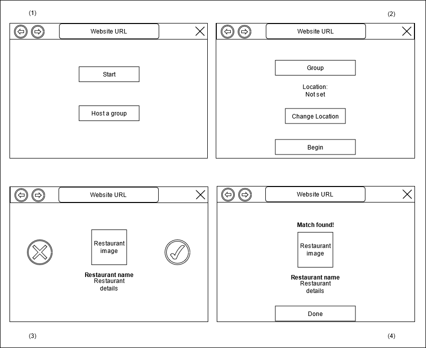

# Teamwork

Leader: Nathaniel  
When2Meet: [click here](https://www.when2meet.com/?11139749-jH8B8)

# OO Design

# Wireframe & Use-case

**Use Case: Receiving assistance in choosing a restaurant**

1. The user opens the application.
2. The user will be presented with the "Start" page, view (1).
3. The user will click on the "Host a group" button.
4. The user will be presented with the "Group" page, view (2).
5. The user will click on the "Change Location" button and input his/her location.
6. The user will click on the "Begin" button.
7. The user will be presented with a "Restaurant option" page, view (3).
8. The user will click on "Yes" if he/she finds the option appealing, or on "No" if he/she finds it unappealing.
9. If the user clicks on "Yes", a new "Restaurant option" page will be presented.
10. If the user swipes right, the "Match found" page, view (4), will be presented.
11. The user will click on the "Done" button and be returned to the "Start" page.

# Iteration Backlog

- As a user, I would like to create a “swiping event” that will present me with a continuous stream of restaurant options so that I can decide where I want to eat.
- As a user, I would like to be able to input my location so that I will only be presented with restaurants that are near me.
- As a user, I would like to be presented with various details about each restaurant so that it will be easier to decide whether I wish to eat there or not.

# Retrospective

For this iteration, we attempted to build a web application that can take in user input and then show restaurant information close to that location. We were able to deploy an application to heroku using React for frontend developent and SparkJava for backend development. Upon opening the application, the user can input a location and, once they press submit, a get request is made to the yelp API in which a list of restaurant objects are returned. The user can then look through the restaurants, where they see an image, title, price, and cuisine type, by clicking the X button on the screen. Prior to the start of the iteration, we initially hoped to also deliver a way to understand which restaurants the user likes and dislikes by the way they press the like and dislike buttons. However, as we started the iteration, we realized we weren't going to be able to deliver that last feature during this iteration so we decided to add it to the next one. Overall, we had some initial challenges with connecting the backend to the frontend and retrieving restaurant information from the yelp API, but we were successful in these tasks by the end. In order to do a better job in the next iteration, we believe we should start the implementation earlier to have more time for debugging and testing. We started development a little late this iteration, so dividing tasks earlier and starting sooner would make for a better iteration 2.
