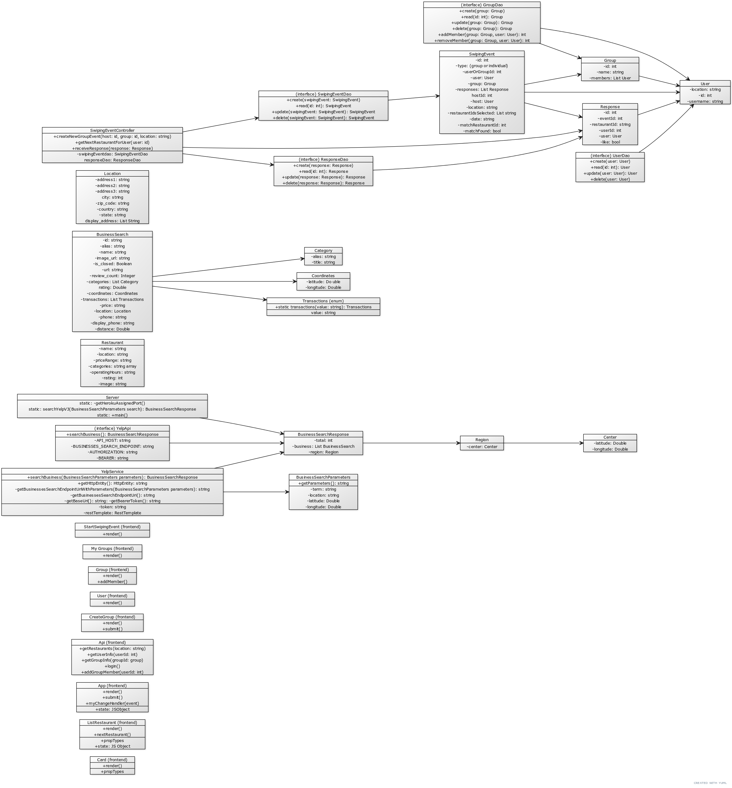
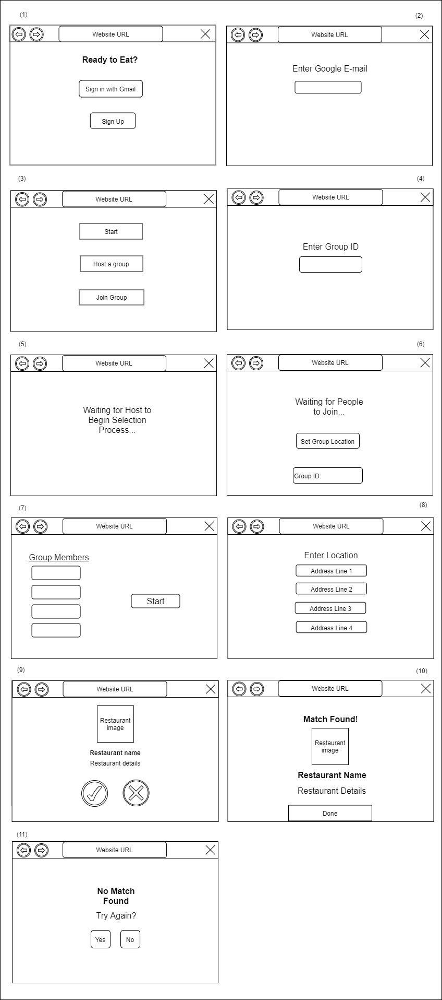

# Teamwork

Leader: Shanelle Cao

When2Meet: [click here](https://www.when2meet.com/?11286799-FBW9N)

# OO Design

# Wireframe & Use-case

**Use Case: Receiving assistance in choosing a restaurant**

1. The user opens the application.
2. The user will be presented with an sign-in/up page, view (1).
    - If they already made an account with us, the user will click on the "Sign in with Gmail" button.
      - The user will enter their e-mail and Google will handle the rest of the sign-in process, view (2).
    - Otherwise, they will click on the “Sign up” button.
      - Then, the user will enter their email such that an account is created, view (2).
3. The user will be presented with the "Start" page, view (3).
    - If they want to choose by themselves, the user will click on “Start”.
    - If they want to join a group, the user will click on the “Join a group” button.
      - The user will enter a group ID which represents a specific group to join, view (4).
      - The user is presented with a “Waiting…” screen until the host begins the selection process, view (5).
    - If they want to host a group, the user will click on the “Host a group” button.
      - The user will set the group’s location by clicking on the “Set Group Location” button.
      - The user will wait for people to join and click the “Start” button once everyone has joined, view (7).
4. The user will be presented with a place to enter their location, view (8).
5. The user/ will be presented with a "Restaurant option" page, view (9).
6. The user will click on "Yes" if they find the option appealing, or on "No" if they find it unappealing.
    - If the user clicks on "Yes", a new "Restaurant option" page will be presented.
7. If the user swipes right, the "Match found" page, view (10), will be presented.
      - The user will click on the "Done" button and be returned to the "Start" page.
8. If the user/group is unable to find a match after swiping through 10 restaurants, then a “No Match Found” screen is displayed, view (11).
    - The user will click “Yes” if they want to swipe through another collection of restaurants.
    - The user will click “No” if they want to end the swiping process.

# Iteration Backlog

- As a user, I would like to create an account and login so that my information can be saved.
- As a user, I would like to join a group so I can decide with my friends where to eat as a group.
- As a user, I would like to create a group so that I can decide where to eat with my friends.
- As a group, we would like to have a group ID so that joining groups are easier.
- As a user, I would like to mark a restaurant as appealing or not during a “swiping event” so that I can narrow down my options.
- As a group, we would like to be notified when we find a match so that we know we have found a place to eat at.
- As a group, we would like the “swiping event” to end after a certain amount of restaurants if no match was found so that it doesn’t go on forever.

# Tasks
- create the frontend interaction for continuous swiping
- create the fronted interaction for joining and hosting groups
- create the frontend interaction for match found/no match found
- implement the account login system
- create the database for storing group IDs
- implement the assignment and managing of group IDs
- create classes for groups
- allow users to create and join groups in the backend
- implement the swiping algorithm for groups
# Retrospective
