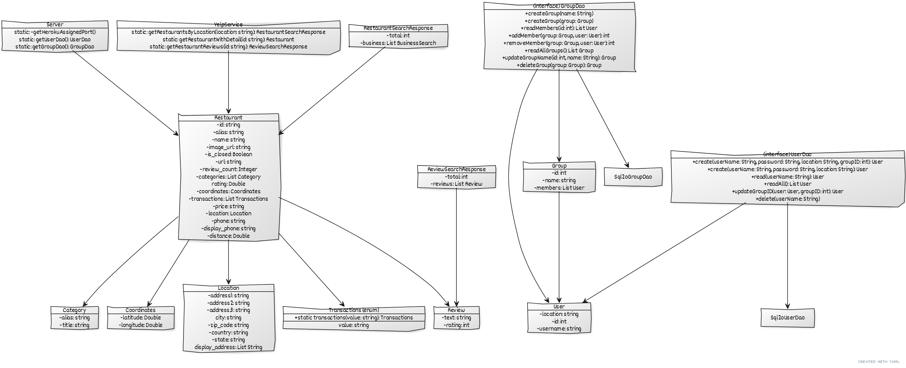
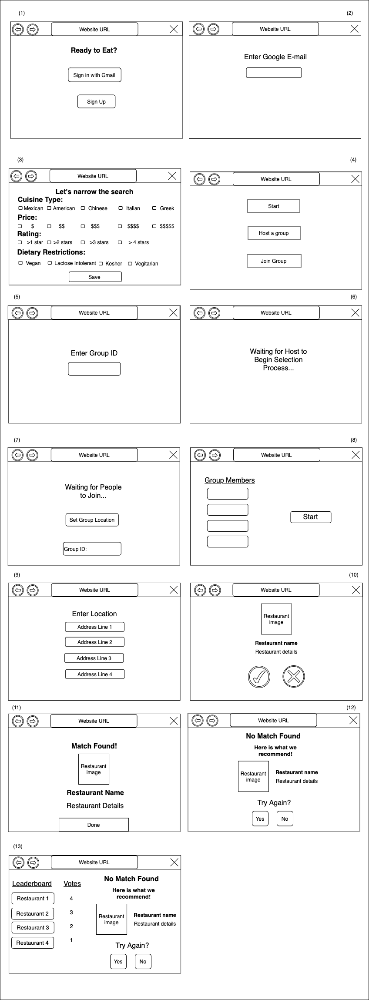

# Teamwork

Leader: 

When2Meet: 

# OO Design

# Wireframe & Use-case

**Use Case: Receiving assistance in choosing a restaurant**

1. The user opens the application.
2. The user will be presented with a sign-in/up page, view (1).
    - If they already made an account with us, the user will click on the "Sign in with Gmail" button.
      - The user will enter their e-mail and Google will handle the rest of the sign-in process, view (2).
    - Otherwise, they will click on the “Sign up” button.
      - Then, the user will enter their email such that an account is created, view (2).
3. The user will be presented with the "Start" page, view (3).
    - If they want to choose by themselves, the user will click on “Start”.
    - If they want to join a group, the user will click on the “Join a group” button.
      - The user will enter a group ID which represents a specific group to join, view (4).
      - The user is presented with a “Waiting…” screen until the host begins the selection process, view (5).
    - If they want to host a group, the user will click on the “Host a group” button.
      - The user will set the group’s location by clicking on the “Set Group Location” button.
      - The user will wait for people to join and click the “Start” button once everyone has joined, view (7).
4. The user will be presented with a place to enter their location, view (8).
5. The user/ will be presented with a "Restaurant option" page, view (9).
6. The user will click on "Yes" if they find the option appealing, or on "No" if they find it unappealing.
    - If the user clicks on "Yes", a new "Restaurant option" page will be presented.
7. If the user swipes right, the "Match found" page, view (10), will be presented.
      - The user will click on the "Done" button and be returned to the "Start" page.
8. If the user/group is unable to find a match after swiping through 10 restaurants, then a “No Match Found” screen is displayed.
    - If not in a group, then the user is presented with a recommendation, view (11).
    - If in a group, then the group is presented with a recommendation and a leaderboard of restaurants to show how people voted for each one, view (12).
9. The user will click “Yes” or "No" if they want to swipe through another collection of restaurants or end the swiping process.

# Iteration Backlog

- As a user, I would like the program to learn my preference for the day based on my swipes and show me restaurants that match my preference so that I can find a restaurant earlier.
- As a group, we would like to be shown a leaderboard of votes from high to low and a recommended restaurant if no match was found so that we can discuss among our options.
- As a user, I would like my location and long term preferences (vegan, vegetarian, allergies etc.) to be remembered so that I don’t have to set it repeatedly.
- As a user, I would like to set filters such as price and cuisine so that I can get tailored options.

# Tasks

- creating and working on the recommendation algorithm (this is beyond CRUD)
- recommending a restaurant if no match was found (frontend? I guess we can "call" the recommendation algorithm)
- showing the top choices of restaurants (involves socket.io, frontend)
- storing permanent user preferences in the backend (involves database and backend)
- allowing the user to store and access permanent preferences in the frontend (UI stuff/React)
- adding filters when searching for restaurants in the backend (involves backend and Yelp API)
- adding UI for filtering restaurants (frontend/UI)

# Retrospective
