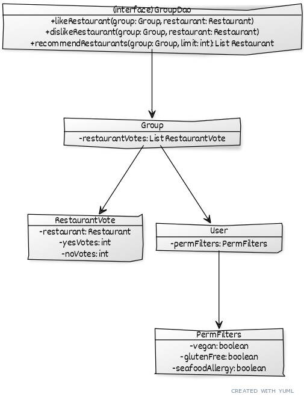
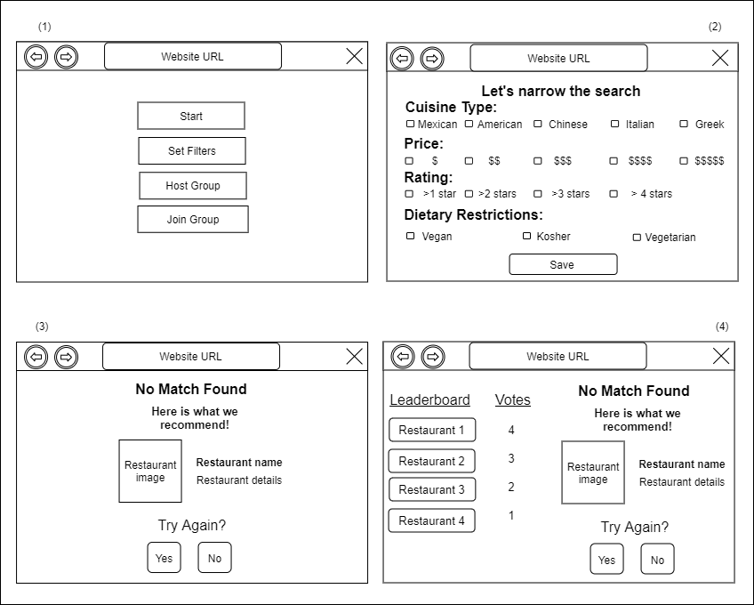

# Teamwork

Leader: Eric

When2Meet: https://www.when2meet.com/?11499666-d2ubT

# OO Design

# Wireframe & Use-case

**Use Case: Receiving assistance in choosing a restaurant**

1. The user will set their preferences for the swiping event using the "Set Filters" button from the "start" page, view (1).
2. The user will select their preferences, such as Cuisine Type or Price, to help filter their results, view (2).
3. If an individual user could not find an exact match based on their preferences, they will be presented with a recommnded restaurant and the option to try again, view (3).
4. If a group could not find an exact match, then they will be presented with a recommended restaurant, option to try again, and a leaderboard of restaurants to see how people generally voted, view (4).

# Iteration Backlog

- As a user, I would like the program to learn my preference for the day based on my swipes and show me restaurants that match my preference so that I can find a restaurant earlier.
- As a group, we would like to be shown a leaderboard of votes from high to low and a recommended restaurant if no match was found so that we can discuss among our options.
- As a user, I would like my location and long term preferences (vegan, vegetarian, allergies etc.) to be remembered so that I don’t have to set it repeatedly.
- As a user, I would like to set filters such as price and cuisine so that I can get tailored options.

# Tasks

- creating and working on the recommendation algorithm (this is beyond CRUD) -> Nathaniel
- recommending a restaurant if no match was found (frontend? I guess we can "call" the recommendation algorithm) -> Eric
- showing the top choices of restaurants (involves socket.io, frontend) -> Shanelle
- storing permanent user preferences in the backend (involves database and backend) -> Siqi
- allowing the user to store and access permanent preferences in the frontend (UI stuff/React) -> Siqi
- adding filters when searching for restaurants in the backend (involves backend and Yelp API) -> Daniel
- adding UI for filtering restaurants (frontend/UI) -> Abdullah

# Retrospective
For this iteration we aimed to accomplish three disjointed main tasks. The first was something that would begin to move our application to something beyond CRUD, which was a complex restaurant recommendation algorithm. The algorithm was built to do two things: continuously reorder the list of restaurants that was fetched from the Yelp API based on an individual user's votes so far, and choose a restaurant recommendation for the entire group if no match was found at the end of a session. Additionally, the restaurants with the highest number of positive votes would be displayed as a leaderboard so the group members have the option to make a decision based off of that. The second task was allowing users to set long-term dietary preferences and storing them on the database in order to make the application more accessible and convenient. The final task was was to give groups the option to set temporary filters on the search for restaurants such as which type of cuisine they were in the mood for, which is a very important piece of functionality for the application to have. Since each of these tasks were virtually independent from each other the strategy we used was to have a branch for each one, and then merge them all at the end of the iteration. The biggest problem we ran into during this iteration occurred near the beginning when as a group we weren't on the same page regarding if we were going to store group information on the Socket connection or on the database. After a meeting we decided the data should be on the Socket connection due to it being inefficient to store temporary data on a database and to avoid the long load times that would result from having to call the database API very often. However, when we were organizing this meeting we had some communication issues that resulted in us earning a yellow card. To remedy these issues in future iterations, we are planning to all fill out the group When2meet as soon as the iteration starts and meet early into the iteration to avoid having prolonged discussions about things that can be decided quickly. In addition, going into the next iteration there are a few small leftover issues that we aim to resolve quickly, such updating style issues and fixing minor bugs.
