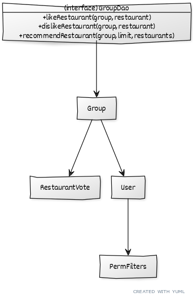

# Teamwork

Leader: Daniel

When2Meet: https://www.when2meet.com/?11547411-ZFkfy

## Meetings
Our meeting time is Monday, 8:30pm

### Past Meetings

Monday, April 5 @ 8:30 pm EDT
- Members Attended: Nathaniel, Eric, Shanelle, Daniel

# OO Design

# Wireframe & Use-case

No change from last iteration.

**Use Case: Receiving assistance in choosing a restaurant**

No change from last iteration.

# Iteration Backlog

- As a user, I would like to create an account and login so that my information can be saved.

# Tasks

- Update wireframe -> Daniel
  - Show updated views of the applicaton

- Update UML Diagram -> Nathaniel
  - Show classes & fields that accurately reflect the backend design
  - Change User.permFilters to User.preferenceList
  - Remove restaurantVotes in Group class
  - Add RestaurantVote class

- Showing restaurant images on MatchFound.js and NotFound.js pages ([#73](https://github.com/cs421sp21-homework/project-g13/issues/73), Abdullah)
- Fixing errors for undefined address values in Individual swiping event ([#58](https://github.com/cs421sp21-homework/project-g13/issues/58), Abdullah)
- Add "Set Filters" button for individuals ([#79](https://github.com/cs421sp21-homework/project-g13/issues/79), Abdullah)
- Add previous image/next image buttons when swiping through restaurants ([#98](https://github.com/cs421sp21-homework/project-g13/issues/98), Abdullah)
- Make the APIs in Server.java follow a try-catch structure as shown in Module 5 ([#99](https://github.com/cs421sp21-homework/project-g13/issues/99), Abdullah)

- Notifying group members when host leaves ([#56](https://github.com/cs421sp21-homework/project-g13/issues/56), Nathaniel)
- Fixing "property alias undefined" error for group recommendations ([#72](https://github.com/cs421sp21-homework/project-g13/issues/72), Nathaniel)
- Implement recommendation algorithm for individuals using existing group implementation ([#78](https://github.com/cs421sp21-homework/project-g13/issues/78), Nathaniel)
- Fix truncated reviews by adding "read more" links to the restaurant's reviews page ([#96](https://github.com/cs421sp21-homework/project-g13/issues/96), Nathaniel)
- Fix restaurant images not showing MatchFound.js ([#97](https://github.com/cs421sp21-homework/project-g13/issues/97), Nathaniel)

- Pulling different restaurants when Individual clicks "Try Again" ([#62](https://github.com/cs421sp21-homework/project-g13/issues/62), Shanelle)
- UI for acessing user's permanent preferences in the frontend ([#95](https://github.com/cs421sp21-homework/project-g13/issues/95), Shanelle)
- Fix sizing/organization of elements in restaurant card ([#80](https://github.com/cs421sp21-homework/project-g13/issues/80), Shanelle)
- Moving styling from "header" to "body" ([#76](https://github.com/cs421sp21-homework/project-g13/issues/76), Shanelle)
- Rearrange the restaurant leaderboard in NotFoundRec.js so the user can easily see it ([#48](https://github.com/cs421sp21-homework/project-g13/issues/48), Shanelle)

- Saving group's location for "Try Again" button ([#74](https://github.com/cs421sp21-homework/project-g13/issues/74), Eric)
- Fixing Match Found errors when member closes out of swiping event window during the event ([#71](https://github.com/cs421sp21-homework/project-g13/issues/71), Eric)
- When a user leaves without pressing "Try Again", the page breaks for everyone ([#81](https://github.com/cs421sp21-homework/project-g13/issues/81), Eric)
- Prevent like/dislike buttons and other text/objects on the restaurant card from overlapping ([#94](https://github.com/cs421sp21-homework/project-g13/issues/94), Eric)
- Create a test class for Server.java 
    - Write unit tests on APIs ([#93](https://github.com/cs421sp21-homework/project-g13/issues/93), Eric)
    - Write Postman tests on APIs ([#92](https://github.com/cs421sp21-homework/project-g13/issues/92), Daniel)
    
- Storing user's permanent preferences in backend 
  - Create column in database for the preferences ([#90](https://github.com/cs421sp21-homework/project-g13/issues/90), Daniel)
  - Create DAO objects for accessing/modfying them ([#91](https://github.com/cs421sp21-homework/project-g13/issues/91), Daniel)
- Implementing login system
  - Show an error message if the backend server is down ([#83](https://github.com/cs421sp21-homework/project-g13/issues/83), Daniel)
  - Fix error "Signup.js:14 POST http://localhost:3000/isLoggedIn 404 (Not Found)" ([#84](https://github.com/cs421sp21-homework/project-g13/issues/84), Daniel)
  - Connecting frontend to database with user credentials ([#85](https://github.com/cs421sp21-homework/project-g13/issues/85), Daniel)
- Record an individual's swipes in backend ([#77](https://github.com/cs421sp21-homework/project-g13/issues/77), Daniel)
- Remove 'backend/build' from git ([#86](https://github.com/cs421sp21-homework/project-g13/issues/86), Daniel)
    - add to .gitignore ([#87](https://github.com/cs421sp21-homework/project-g13/issues/87), Daniel)
- Creating & integrating custom exceptions for backend server ([#89](https://github.com/cs421sp21-homework/project-g13/issues/89), Daniel)
  - Throw HTTP error codes including non-404 errors (make the error codes accurately reflect the error) ([#88](https://github.com/cs421sp21-homework/project-g13/issues/88), Daniel)

# Retrospective

