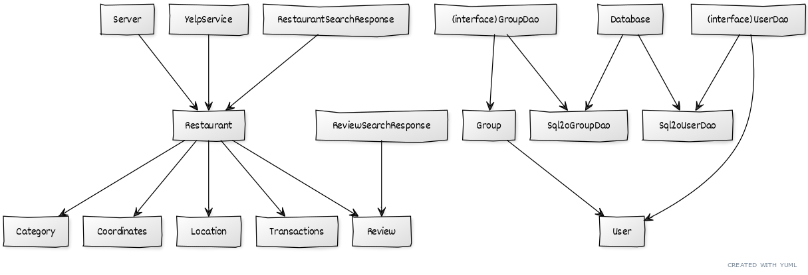

# Teamwork

Leader: Daniel

When2Meet: https://www.when2meet.com/?11547411-ZFkfy

## Meetings
Our meeting time is Monday, 8pm

### Past Meetings

Monday, April 5 @ 8:30 pm EDT
- Members Attended: Nathaniel, Eric, Shanelle, Daniel

# OO Design

# Wireframe & Use-case

No change from last iteration.

**Use Case: Receiving assistance in choosing a restaurant**

No change from last iteration.

# Iteration Backlog

- As a user, I would like to create an account and login so that my information can be saved.

# Tasks

- Update wireframe -> Daniel
 - Show updated views of the applicaton

- Update UML Diagram -> Nathaniel
  - Show classes & fields that accurately reflect the backend design
  - Change User.permFilters to User.preferenceList
  - Remove restaurantVotes in Group class
  - Add RestaurantVote class

- Creating & integrating custom exceptions into the backend 
  - Throw HTTP error codes including non-404 errors (make the error codes accurately reflect the error)

- Fix restaurant images not showing on the match found page

- Fix truncated reviews and next to the review, add "read more" links to the restaurant's reviews page 

- Prevent like/dislike buttons and other text/objects on the restaurant card from overlaping

- Fix missing previous image/next image buttons

- Rearrange the restaurant leaderboard on the match found page so the user can easily see it

- Remove 'backend/build' from git

- Create a test class for Server.java

- Make the APIs in the backend follow a try-catch structure as shown in Module 5

- Saving group's location for "Try Again" button -> Eric
- Fixing Match Found errors when member closes out of swiping event window during the event -> Eric
- When a user leaves without pressing "Try Again", the page breaks for everyone -> Eric

- Showing restaurant images/reviews on "Match Found" and "Not Found" pages -> Abdullah
- Fixing errors for undefined address values in Individual swiping event -> Abdullah
- Add "Set Filters" button for individuals -> Abdullah

- Notifying group members when host leaves -> Nathaniel
- Fixing "property alias undefined" error for group recommendations -> Nathaniel
- Fix recommendation algorithm for individuals -> Nathaniel

- Pulling different restaurants when Individual clicks "Try Again" -> Shanelle
- Storing/Acessing user's permanent preferences in the frontend -> Shanelle
- Fix sizing/organization of elements in restaurant card -> Shanelle
- Moving styling from "<header>" to "<body>" -> Shanelle

- Storing user's permanent preferences in backend -> Daniel
- Implementing login system -> Daniel
  - Show an error message if the backend server is down
  - Fix error "Signup.js:14 POST http://localhost:3000/isLoggedIn 404 (Not Found)"
- Record an individual's swipes in backend -> Daniel

# Retrospective

