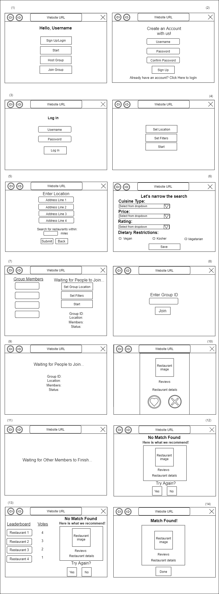

# Teamwork

Leader: Daniel

When2Meet: https://www.when2meet.com/?11547411-ZFkfy

## Meetings
Our meeting time is Monday, 8:30pm

### Past Meetings

Monday, April 5 @ 8:30 pm EDT
- Members Attended: Nathaniel, Eric, Shanelle, Daniel

Monday, April 12 @ 8:30 pm EDT
- Members Attended: Nathaniel, Eric, Daniel

# OO Design

# Wireframe & Use-case

**Use Case: Cumulative Functionality of App**

1. The user opens the application.
2. The user will be presented with the "Start" page, view (1).
3. If the user wants to sign-in or create an account, they will click on the "Sign Up/Login" button.
    - The user will enter a username and password to create an account, view (2).
    - If the user has as account, they will enter their credentials in view (3).
4. If they want to begin swiping by themselves, the user will click on “Start”.
    - They will be presented with buttons for setting locations/preferences and starting the event, view (4).
5. If they want to join a group, the user will click on the “Join a group” button.
    - The user will enter a group ID which represents a specific group to join, view (8).
    - The user is presented with a “Waiting…” screen until the host begins the selection process, view (9).
6. If they want to host a group, the user will click on the “Host a group” button.
    - The user will set the group’s location/preferences by clicking on the “Set Group Location”/"Set Filters" buttons, view (7).
    - The user will wait for people to join and click the “Start” button once everyone has joined, view (7).
7. By clicking on the "Set Location" button, the user will be able to enter their address and desired search radius, view (5).
8. By clicking on the "Set Filters" button, the user will be able to set their preferences, view (6).
9. Once the swiping event begins, the user will be presented with potential restaurants, view (10).
10. The user will click on "Heart" if they find the option appealing, or "X" if they find it unappealing.
    - If an individual user presses the "X" button, then another restaurant will be presented, view (10).
    - If an individual user presses the "Heart" button, the "Match found" page will be presented, view (14).
      - The user will click on the "Done" button and be returned to the "Start" page, view (1).
11. If a user in a group presses the "Heart" button, they will continue selecting restaurants until a match is found/recommended to the group.
12. If some group members finish before others, then they are presented with a "Waiting..." screen, view (11).
13. If the user/group is unable to find a match after swiping through 10 restaurants, then a “No Match Found” screen is displayed.
    - If not in a group, then the user is presented with a recommendation, view (12).
    - If in a group, then the group is presented with a recommendation and a leaderboard of restaurants to show how people voted for each one, view (13).
14. The user will click “Yes” or "No" if they want to swipe through another collection of restaurants or end the swiping process.

# Iteration Backlog

- [Fixing/polishing user stories from iterations 1-4](roadmap.md)

# Tasks

- Update wireframe -> Daniel :white_check_mark:
  - Show updated views of the applicaton

- Update UML Diagram -> Nathaniel :white_check_mark:
  - Show classes & fields that accurately reflect the backend design
  - Change User.permFilters to User.preferenceList
  - Remove restaurantVotes in Group class
  - Add RestaurantVote class

- Showing restaurant images on MatchFound.js and NotFound.js pages ([#73](https://github.com/cs421sp21-homework/project-g13/issues/73), Abdullah) :white_check_mark:
- Fixing errors for undefined address values in Individual swiping event ([#58](https://github.com/cs421sp21-homework/project-g13/issues/58), Abdullah) :white_check_mark:
- Add "Set Filters" button for individuals ([#79](https://github.com/cs421sp21-homework/project-g13/issues/79), Abdullah) :white_check_mark:
- Add previous image/next image buttons when swiping through restaurants ([#98](https://github.com/cs421sp21-homework/project-g13/issues/98), Abdullah) :white_check_mark:
- Make the APIs in Server.java follow a try-catch structure as shown in Module 5 ([#99](https://github.com/cs421sp21-homework/project-g13/issues/99), Abdullah) :white_check_mark:
- Remove 'backend/build' from git ([#86](https://github.com/cs421sp21-homework/project-g13/issues/86), Abdullah) :white_check_mark:

- Notifying group members when host leaves ([#56](https://github.com/cs421sp21-homework/project-g13/issues/56), Nathaniel) :black_square_button:
- Fixing "property alias undefined" error for group recommendations ([#72](https://github.com/cs421sp21-homework/project-g13/issues/72), Nathaniel) :black_square_button:
- Implement recommendation algorithm for individuals using existing group implementation ([#78](https://github.com/cs421sp21-homework/project-g13/issues/78), Nathaniel) :white_check_mark:
- Fix truncated reviews by adding "read more" links to the restaurant's reviews page ([#96](https://github.com/cs421sp21-homework/project-g13/issues/96), Nathaniel) :black_square_button:
- Fix restaurant images not showing MatchFound.js ([#97](https://github.com/cs421sp21-homework/project-g13/issues/97), Nathaniel) :black_square_button:

- Pulling different restaurants when Individual clicks "Try Again" ([#62](https://github.com/cs421sp21-homework/project-g13/issues/62), Shanelle) :black_square_button:
- UI for acessing user's permanent preferences in the frontend ([#95](https://github.com/cs421sp21-homework/project-g13/issues/95), Shanelle) :black_square_button:
- Fix sizing/organization of elements in restaurant card ([#80](https://github.com/cs421sp21-homework/project-g13/issues/80), Shanelle) :black_square_button:
- Separate styling into more components ([#76](https://github.com/cs421sp21-homework/project-g13/issues/76), Shanelle) :black_square_button:
- Rearrange the restaurant leaderboard in NotFoundRec.js so the user can easily see it ([#48](https://github.com/cs421sp21-homework/project-g13/issues/48), Shanelle) :black_square_button:

- Saving group's location for "Try Again" button ([#74](https://github.com/cs421sp21-homework/project-g13/issues/74), Eric) :white_check_mark:
- Fixing Match Found errors when member closes out of swiping event window during the event ([#71](https://github.com/cs421sp21-homework/project-g13/issues/71), Eric) :black_square_button:
- When a user leaves without pressing "Try Again", the page breaks for everyone ([#81](https://github.com/cs421sp21-homework/project-g13/issues/81), Eric) :black_square_button:
- Prevent like/dislike buttons and other text/objects on the restaurant card from overlapping ([#94](https://github.com/cs421sp21-homework/project-g13/issues/94), Eric) :black_square_button:
- Create a test class for Server.java :black_square_button:
    - Write unit tests on APIs ([#93](https://github.com/cs421sp21-homework/project-g13/issues/93), Eric) :black_square_button:
    - Write Postman tests on APIs ([#92](https://github.com/cs421sp21-homework/project-g13/issues/92), Daniel) :black_square_button:
    
- Storing user's permanent preferences in backend :white_check_mark:
  - Create column in database for the preferences ([#90](https://github.com/cs421sp21-homework/project-g13/issues/90), Daniel) :white_check_mark:
  - Create DAO methods for accessing/modfying them ([#91](https://github.com/cs421sp21-homework/project-g13/issues/91), Daniel) :white_check_mark:
- Implementing login system :white_check_mark:
  - Show an error message if the backend server is down ([#83](https://github.com/cs421sp21-homework/project-g13/issues/83), Daniel) :white_check_mark:
  - Fix error "Signup.js:14 POST http://localhost:3000/isLoggedIn 404 (Not Found)" ([#84](https://github.com/cs421sp21-homework/project-g13/issues/84), Daniel) :white_check_mark:
  - Connecting frontend to database with user credentials ([#85](https://github.com/cs421sp21-homework/project-g13/issues/85), Daniel) :white_check_mark:
- Record an individual's swipes in backend ([#77](https://github.com/cs421sp21-homework/project-g13/issues/77), Daniel) :black_square_button:
- Add 'backend/build' to .gitignore ([#87](https://github.com/cs421sp21-homework/project-g13/issues/87), Daniel) :white_check_mark:
- Creating & integrating custom exceptions for backend server ([#89](https://github.com/cs421sp21-homework/project-g13/issues/89), Daniel) :black_square_button:
  - Throw HTTP error codes including non-404 errors (make the error codes accurately reflect the error) ([#88](https://github.com/cs421sp21-homework/project-g13/issues/88), Daniel) :black_square_button:

# Retrospective

Things that worked well:
- This iteration involved a shift in focus from implementing new features to fixing existing features and improving overall styling of the application. We had the best start as group during this iteration since the tasks were allocated early and clearly. Thanks to advice from our advisors, we were able to create a planning document that accurately reflected what needed to be accomplished. In addition, we filled out the when2meet early so we were able to decide on extra meeting times days in advance. Last iteration, we attempted to implemented a "soft" goal of having all tasks completed by the 2nd Thursday so that we could have two days solely for merging and testing. This goal inspired us to strive for having something to demo during every advisor meeting to ensure that progress that being made. Notably, we finally implemented a login system so that unique users can set long-term preferences on an account page. In general, we seem to have gotten used to iterative development and we are all happy with our progress thus far. 

Things to be improved:
- Merging all of our pieces earlier would allow for smoother and less stressful development as we approach that iteration's deadline.
  - Generally, we merged as we developed so it was less stressful than other iterations.

Plans for next iteration:
- As we prepare for the final presentation and demo, we will continue fixing bugs/styling and potentially implement a new feature to fetch restaurants that are open at the time of swiping or trending in the area.
- We will continue to create detailed planning documents as they made it easier to track progress and understand what not yet been implemented.
