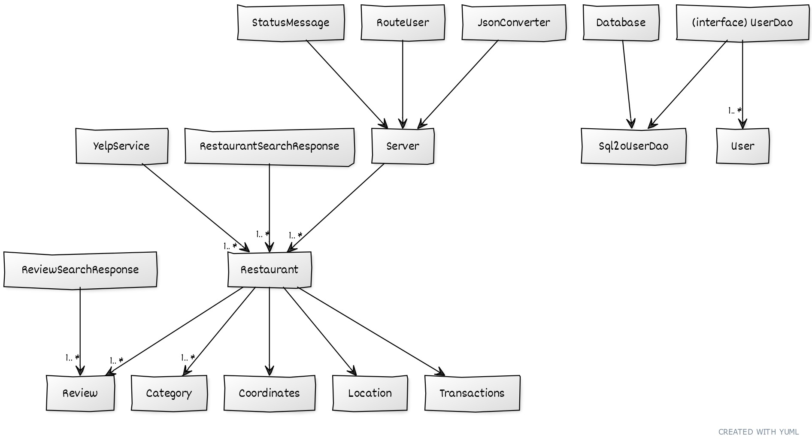
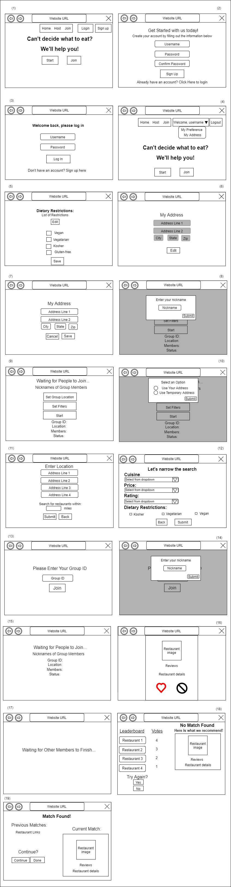

# Teamwork

Leader: Abdullah

When2Meet: https://www.when2meet.com/?11681146-YlLxK

## Meetings
Our meeting time is Monday/Saturday 3/4pm EDT

### Future Meetings

### Past Meetings
April 19, 2021 @ 4pm
Meeting tasks:
- Decide what user stories to complete for iteration 5
  - Assign tasks
- Decide on what everyone will do for the final presentation
  - Opening remarks -> Shanelle
  - Closing remarks -> Nathaniel
  - Who will demo what
    - Individual swiping process with filters-> Eric
    - Joining/hosting groups -> Shanelle
    - Recommendation and leaderboard on no match found page -> Nathaniel
    - Login and storing user preferences -> Abdullah
  - What technical aspects will everyone discuss
    - Frontend (React, etc) -> Shanelle
    - Backend overview (UML) and Database -> Daniel
    - Hosting/joining groups with socket.io -> Abdullah
    - Retrieving restaurant data from Yelp -> Eric
    - Recommendation algorithm -> Nathaniel
    
Saturday, April 24 3pm EDT 
- Practiced the presentation

Monday, April 26 3pm EDT
- Practiced the presentation

# OO Design

# Wireframe & Use-case

**Use Case: Overall App Function**
1. The user opens the application.
2. The user will be presented with the "Start" page, view (1).
3. If the user wants to sign-in or create an account, they will click on the "Sign Up" or "Login" button.
    - The user will enter a username and password to create an account, view (2).
    - If the user has as account, they will enter their credentials in view (3).
4. After logging in, the user is redirected to the "Home" page where they can now access their Account to save their Address or Preferences, view (4).
    - The user can enter a nickname that other group members can see, view (5).
5. If the user wants to set dietary restrictions that are unlikely to change between swiping events, they can click on 'My Preference' from the dropdown in view (4).
    - The user can see current dietary restrictions and click 'Edit' and 'Save' to update and save them, view (5).
6. If the user wants to store their address for faster swiping event set-up, they will click on 'My Address' from the dropdown, view (4).
    - The user will be presented with the current address saved in database.
    - The user will click on 'Edit' to enter an address and 'Save' to save the change, views (6/7).
7. If the user wants to logout, they can click the "Logout" button on the "Account" page, view (4).
    - They will be redirected to view (1) where account-less swiping can occur.
8. If they want to begin swiping by themselves, the user will click on “Start”, view (1).
    - They will be presented with a place to enter a nickname (name displayed to fellow group memebers), view (8).
    - They will be presented with buttons for setting locations/preferences and starting the event, view (9).
9. If they want to join a group, the user will click on the “Join” button, view (1).
    - The user will enter a group ID which represents a specific group to join, view (13).
    - They will be presented with a place to enter a nickname (name displayed to fellow group memebers), view (14).
    - The user is presented with a “Waiting…” screen until the host begins the selection process, view (15).
10. If they want to host a group, the user will click on the “Host” button on the top of the webpage, view (1).
    - They will be presented with a place to enter a nickname (name displayed to fellow group memebers), view (8).
    - The user will set the group’s location/preferences by clicking on the “Set Group Location”/"Set Filters" buttons, view (9).
    - The user will wait for people to join and click the “Start” button once everyone has joined, view (9).
11. By clicking on the "Set Group Location" button, the user will be able to enter their address and desired search radius, view (11).
    - If the user is logged in, then they will be presented with the option to use their address currently stored in database, view (10).
12. By clicking on the "Set Filters" button, the user will be able to set their preferences, view (12).
13. Once the swiping event begins, the user/group will be presented with potential restaurants, view (16).
14. The user will click on ":heart:" if they find the option appealing, or ":no_entry_sign:" if they find it unappealing.
    - If an individual user presses the ":no_entry_sign:" button, then another restaurant will be presented, view (16).
    - If an individual user presses the ":heart:" button, the "Match found" page will be presented, view (19).
      - If the user clicks on the "Continue" button, then they will continue swiping with different restaurants and same location. They are taken to view (9) to formally begin another swiping event. 
        - As the user conducts consecutive swiping events in this manner, matches from previous swiping events are displayed, view (19).
      - If the user is done, then they will click on 'Done' to end the event and return to 'Home' page, view(1).
15. If a user in a group presses the ":heart:" button, they will continue selecting restaurants until a match is found/recommended to the group.
    - If a match is found, then the 'Match Found' page is displayed, view(19) (with similar functionality as described in previous use-case).
16. If some group members finish before others, then they are presented with a "Waiting..." screen, view (17).
17. If the user/group is unable to find a match after swiping through 10 restaurants, then a “No Match Found” screen is displayed, view (18).
    - If not in a group, then the user is presented with a recommendation.
      - The user can click 'Try Again' to swipe through new restaurants or 'No' to end the swiping process.
    - If in a group, then the group is presented with a recommendation and a leaderboard of restaurants to show how people voted for each one.

# Iteration Backlog
- As a user, I would like to continue swiping if a match is already found so that I can find more potential places I want to eat at.
- As a user, I would like to see who’s in the group so that I know all my friends have joined.

# Tasks

- Allow users/groups to continue swiping when a match is found [#118](https://github.com/cs421sp21-homework/project-g13/issues/118) -> Eric :black_square_button:
  - Add buttons in the MatchFound and No Match Found pages to continue searching for restaurants [#119](https://github.com/cs421sp21-homework/project-g13/issues/119) :black_square_button:

- Test the app rigorously [#135](https://github.com/cs421sp21-homework/project-g13/issues/135) -> Nathaniel :black_square_button:

- Make the socket.io server send a group member name when someone joins a group [#123](https://github.com/cs421sp21-homework/project-g13/issues/123) -> Abdullah :white_check_mark:
  - Make the Group page receive such "member name" data :white_check_mark:
  - Upon receiving such data (described above), show the names of members of the group on the page [#124](https://github.com/cs421sp21-homework/project-g13/issues/124) :white_check_mark:

- UI Improvements [#133](https://github.com/cs421sp21-homework/project-g13/issues/133) -> Shanelle :black_square_button:
  - Clarifying buttons on the home page [#125](https://github.com/cs421sp21-homework/project-g13/issues/125) :black_square_button:
  - Making sure pages look the same [#126](https://github.com/cs421sp21-homework/project-g13/issues/126) :black_square_button:
  - Adding UI for storing user info [#127](https://github.com/cs421sp21-homework/project-g13/issues/127) :black_square_button:
  - Add a logout button on account page [#128](https://github.com/cs421sp21-homework/project-g13/issues/128) :black_square_button:

- Refining user login system [#132](https://github.com/cs421sp21-homework/project-g13/issues/132) -> Daniel :white_check_mark:
  - User doesn't get logged out after refreshing [#117](https://github.com/cs421sp21-homework/project-g13/issues/117) :white_check_mark:
  - Connect user accounts preferences to restaurant search in socket.io [#134](https://github.com/cs421sp21-homework/project-g13/issues/134) :white_check_mark:
  - Allowing users to store/retrieve their addresses [#129](https://github.com/cs421sp21-homework/project-g13/issues/129) :white_check_mark:
    - Add an endpoint for storing addresses [#138](https://github.com/cs421sp21-homework/project-g13/issues/130) :white_check_mark:
    - Add an endpoint for retreiving addresses [#131](https://github.com/cs421sp21-homework/project-g13/issues/131) :white_check_mark:

- Wireframe -> Daniel

# Retrospective

## What worked well
Overall, this iteration went by smoothly. We learned a lot about project management and how to structure our project from previous iterations, so our plan for this iteration was very mature and well done. We were able to meet and divide tasks at the beginning of the iteration. For this iteration, we focused on adding two new user stories and squishing bugs present in our app. The new user stories were incorporated into our app smoothly and without too much difficulty. We were able to successfully squish bugs and fix inconsistencies in our app (e.g. making the UI look uniform). One challenge we faced was Heroku not working well, and we were able to solve this issue by changing the configuration of our app. Overall, we were able to collaborate well. I believe we are satisfied with the progress of our app and the current state of the app.

## Things to be improved
My biggest worry about the app is the presence of unfound bugs. Despite squishing many bugs, I believe we could have greater emphasized finding bugs in our plan. We could have given each person an area within the app to test rigoursly in order to find bugs. That's all we could have improved, I suppose.

## Plans for next iteration
No more iterations. How sad!
