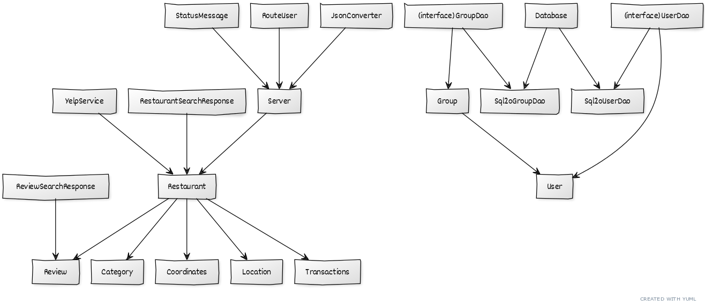

# Teamwork

Leader: Abdullah

When2Meet: https://www.when2meet.com/?11681146-YlLxK

## Meetings
Our meeting time is 4pm EDT

### Future Meetings

### Past Meetings
April 19, 2021 @ 4pm
Meeting tasks:
- Decide what user stories to complete for iteration 5
  - Assign tasks
- Decide on what everyone will do for the final presentation
  - Opening remarks -> Shanelle
  - Closing remarks -> Nathaniel
  - Who will demo what
    - Individual swiping process (location only) -> Daniel
    - Searching for restaurants with filters -> Eric
    - Joining/hosting groups -> Shanelle
    - Recommendation and leaderboard on no match found page -> Nathaniel
    - Login and storing user preferences -> Abdullah
  - What technical aspects will everyone discuss
    - Frontend (React, etc) -> Shanelle
    - Backend overview (UML) and Database -> Daniel
    - Hosting/joining groups with socket.io -> Abdullah
    - Retrieving restaurant data from Yelp -> Eric
    - Recommendation algorithm -> Nathaniel
    
Saturday, April 24 3pm EDT 
- Practiced the presentation

Monday, April 26 3pm EDT
- Practiced the presentation

# OO Design

# Wireframe & Use-case

**Use Case: Overall App Function**
1. The user opens the application.
2. The user will be presented with the "Start" page, view (1).
3. If the user wants to sign-in or create an account, they will click on the "Sign Up" or "Login" button.
    - The user will enter a username and password to create an account, view (2).
    - If the user has as account, they will enter their credentials in view (3).
4. After logging in, the user is redirected to the "Home" page where they can now access their "Account: page, view (4).
5. If the user wants to set preferences that are unlikely to change between swiping events, they can click on options from view (5) and save them.
6. If the user wants to logout, they can click the "Logout" button on the "Account" page, view (5).
    - They will be redirected to view (1) where account-less swiping can occur.
7. If they want to begin swiping by themselves, the user will click on “Start”, view (4).
    - They will be presented with buttons for setting locations/preferences and starting the event, view (6).
5. If they want to join a group, the user will click on the “Join a group” button, view (4).
    - The user will enter a group ID which represents a specific group to join, view (10).
    - The user is presented with a “Waiting…” screen until the host begins the selection process, view (11).
6. If they want to host a group, the user will click on the “Host” button on the top of the webpage, view (4).
    - The user will set the group’s location/preferences by clicking on the “Set Group Location”/"Set Filters" buttons, view (9).
    - The user will wait for people to join and click the “Start” button once everyone has joined, view (9).
7. By clicking on the "Set Location" button, the user will be able to enter their address and desired search radius, view (7).
8. By clicking on the "Set Filters" button, the user will be able to set their preferences, view (8).
9. Once the swiping event begins, the user will be presented with potential restaurants, view (12).
10. The user will click on "Heart" if they find the option appealing, or "X" if they find it unappealing.
    - If an individual user presses the "X" button, then another restaurant will be presented, view (12).
    - If an individual user presses the "Heart" button, the "Match found" page will be presented, view (16).
      - The user will click on the "No" button and be returned to the "Start" page, view (4).
11. If a user in a group presses the "Heart" button, they will continue selecting restaurants until a match is found/recommended to the group.
12. If some group members finish before others, then they are presented with a "Waiting..." screen, view (13).
13. If the user/group is unable to find a match after swiping through 10 restaurants, then a “No Match Found” screen is displayed.
    - If not in a group, then the user is presented with a recommendation, view (14).
    - If in a group, then the group is presented with a recommendation and a leaderboard of restaurants to show how people voted for each one, view (15).
14. At the end of a swiping event, the user will click “Yes” or "No" if they want to swipe through another collection of restaurants or end the process, views (14,15,16).

# Iteration Backlog
- As a user, I would like to continue swiping if a match is already found so that I can find more potential places I want to eat at.
- As a user, I would like to see who’s in the group so that I know all my friends have joined.

# Tasks

- Allow users/groups to continue swiping when a match is found [#118](https://github.com/cs421sp21-homework/project-g13/issues/118) -> Eric :black_square_button:
  - Add buttons in the MatchFound and No Match Found pages to continue searching for restaurants [#119](https://github.com/cs421sp21-homework/project-g13/issues/119) :black_square_button:

- Test the app rigorously [#135](https://github.com/cs421sp21-homework/project-g13/issues/135) -> Nathaniel :black_square_button:

- Make the socket.io server send a group member name when someone joins a group [#123](https://github.com/cs421sp21-homework/project-g13/issues/123) -> Abdullah :black_square_button:
  - Make the Group page receive such "member name" data :black_square_button:
  - Upon receiving such data (described above), show the names of members of the group on the page [#124](https://github.com/cs421sp21-homework/project-g13/issues/124) :black_square_button:

- UI Improvements [#133](https://github.com/cs421sp21-homework/project-g13/issues/133) -> Shanelle :black_square_button:
  - Clarifying buttons on the home page [#125](https://github.com/cs421sp21-homework/project-g13/issues/125) :black_square_button:
  - Making sure pages look the same [#126](https://github.com/cs421sp21-homework/project-g13/issues/126) :black_square_button:
  - Adding UI for storing user info [#127](https://github.com/cs421sp21-homework/project-g13/issues/127) :black_square_button:
  - Add a logout button on account page [#128](https://github.com/cs421sp21-homework/project-g13/issues/128) :black_square_button:

- Refining user login system [#132](https://github.com/cs421sp21-homework/project-g13/issues/132) -> Daniel :black_square_button:
  - User doesn't get logged out after refreshing [#117](https://github.com/cs421sp21-homework/project-g13/issues/117) :black_square_button:
  - Connect user accounts preferences to restaurant search in socket.io [#134](https://github.com/cs421sp21-homework/project-g13/issues/134) :black_square_button:
  - Allowing users to store/retrieve their addresses [#129](https://github.com/cs421sp21-homework/project-g13/issues/129) :black_square_button:
    - Add an endpoint for storing addresses [#138](https://github.com/cs421sp21-homework/project-g13/issues/130) :black_square_button:
    - Add an endpoint for retreiving addresses [#131](https://github.com/cs421sp21-homework/project-g13/issues/131) :black_square_button:

- Wireframe -> Daniel

# Retrospective

